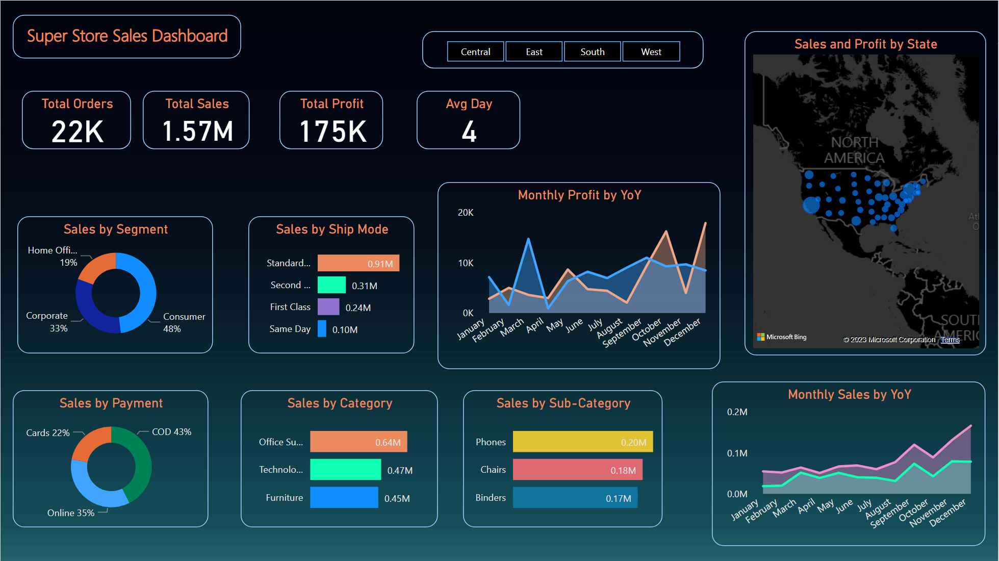

# Superstore Sales Dashboard

This Superstore Sales Dashboard project provides a visual representation of key performance indicators (KPIs) and various sales insights for a fictional superstore. The dashboard includes a collection of interactive visualizations that help analyze sales data and gain valuable insights.

## Features

The Superstore Sales Dashboard offers the following features:

### Filter

The dashboard includes a filter feature that allows users to individually analyze the insights for different regions. Users can select a specific region to view sales and profit data specific to that region.

### KPI Cards

1. **Total Order KPI**: Tracks the total number of orders placed.
2. **Total Sales**: Tracks the total sales revenue generated.
3. **Total Profit**: Tracks the total profit earned.
4. **Avg Day**: Displays the average delivery time in days.

### Donut Charts

1. **Sales by Segment**: Shows the percentage of sales generated by different customer segments, such as Home Office, Corporate, and Consumer.
2. **Sales by Payment Mode**: Displays the percentage of sales made through various payment methods, such as credit cards, online payments, and cash on delivery (COD).

### Bar Charts

1. **Sales by Ship Mode**: Illustrates the distribution of sales across different shipping modes.
2. **Sales by Category**: Represents the sales performance of different product categories, such as furniture, office supplies, and technology.
3. **Sales by Top 3 Subcategories**: Highlights the sales figures of the top three subcategories.

### Area Charts

1. **Monthly Profit by YoY**: Tracks the monthly profit of the superstore over multiple years, enabling year-over-year comparison.
2. **Monthly Sales by YoY**: Shows the monthly sales revenue of the superstore over multiple years, facilitating year-over-year analysis.

### Map Visualization

The **Sales and Profit by State** map provides an interactive representation of sales and profit figures by different states. It offers a geographical view of the superstore's performance across different regions.

## Insights

The Superstore Sales Dashboard provides valuable insights into the performance and trends of the superstore's sales data. Here are some key insights that can be obtained from the dashboard:

1. **Sales Performance by Segment**: By analyzing the "Sales by Segment" donut chart, you can identify which customer segments contribute the most to the overall sales. This information can help in understanding the target audience and devising targeted marketing strategies.

2. **Payment Method Preferences**: The "Sales by Payment Mode" donut chart showcases the percentage of sales made through different payment methods. By studying this chart, you can gain insights into the preferred payment methods of customers, which can inform decisions related to payment processing and options offered to customers.

3. **Shipping Mode Efficiency**: The "Sales by Ship Mode" bar chart displays the distribution of sales across different shipping modes. By examining this chart, you can identify the most frequently used shipping modes and evaluate their efficiency in terms of sales revenue. This information can be used to optimize the shipping process and improve customer satisfaction.

4. **Category-wise Sales Analysis**: The "Sales by Category" bar chart provides a clear view of the sales performance across various product categories. It helps identify the categories that contribute the most to the overall sales revenue, enabling informed decisions regarding inventory management, marketing efforts, and product assortment.

5. **Top-performing Subcategories**: The "Sales by Top 3 Subcategory" bar chart highlights the sales figures of the top three subcategories. This information helps identify specific product subcategories that are performing exceptionally well, allowing for focused attention on these areas for further growth and optimization.

6. **Profitability Trends**: The "Monthly Profit by YoY" area chart showcases the monthly profit over multiple years, enabling year-over-year comparison. By studying this chart, you can observe profitability trends, identify seasonal patterns, and make strategic decisions based on the financial performance of the superstore.

7. **Geographical Performance**: The "Sales and Profit by State" map visualization provides a geographical representation of sales and profit figures across different states. By exploring this map, you can identify regions that are driving significant sales and profit, as well as regions that may require targeted marketing efforts or operational improvements.

These insights help stakeholders gain a comprehensive understanding of the superstore's sales performance, customer behavior, and areas for improvement. By leveraging the dashboard's visualizations, actionable strategies can be devised to optimize operations, enhance profitability, and drive overall business growth.

